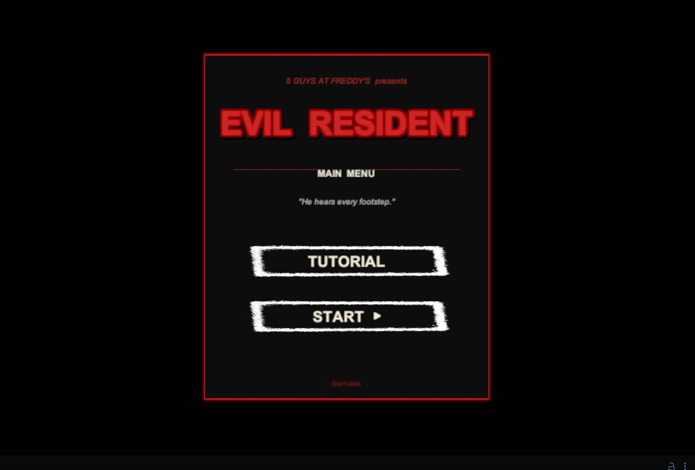
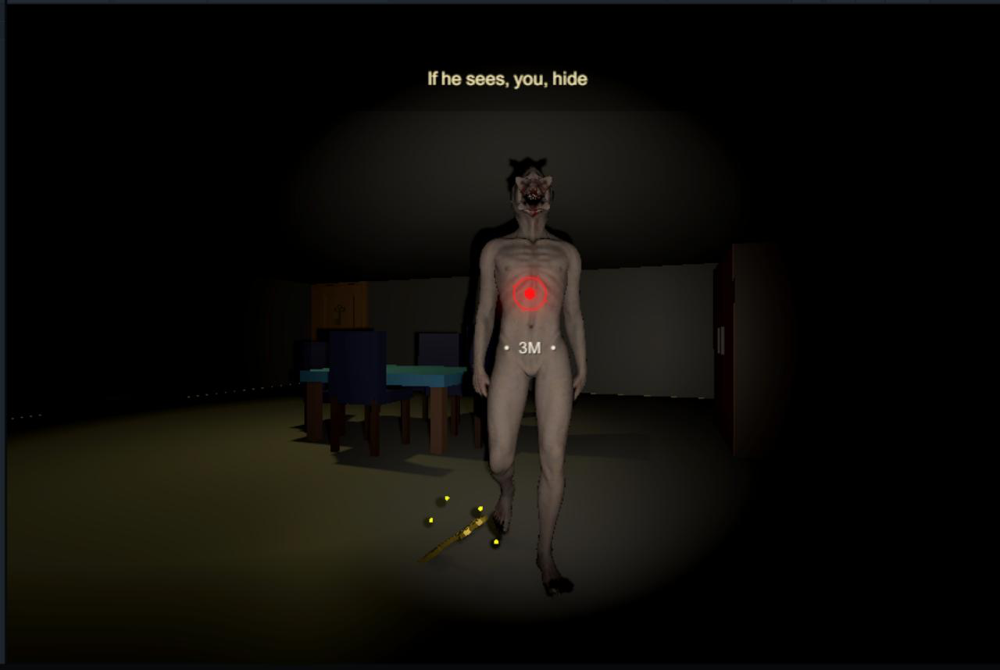
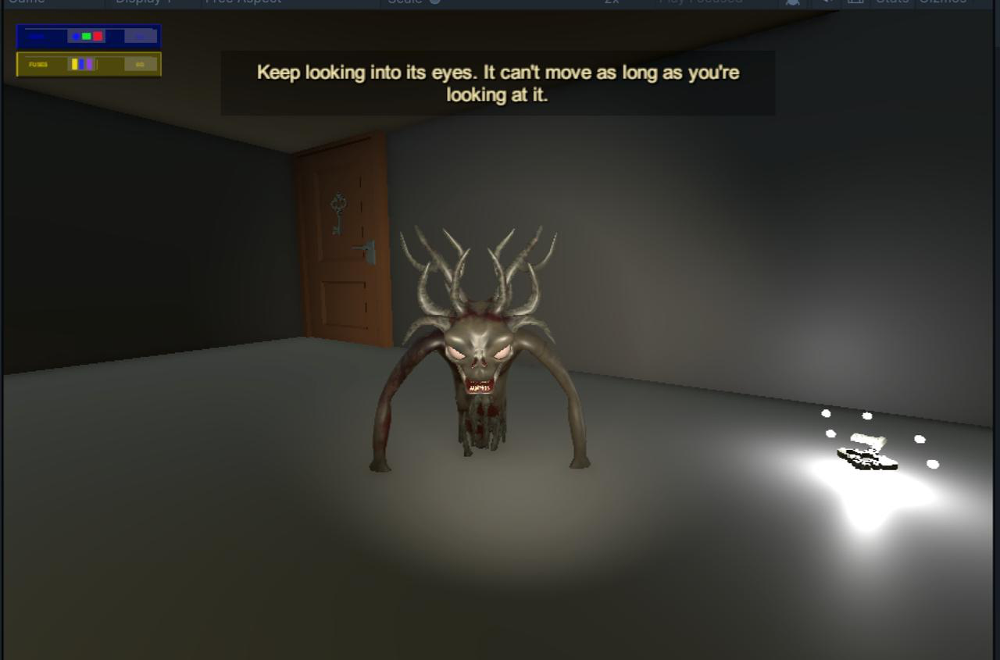
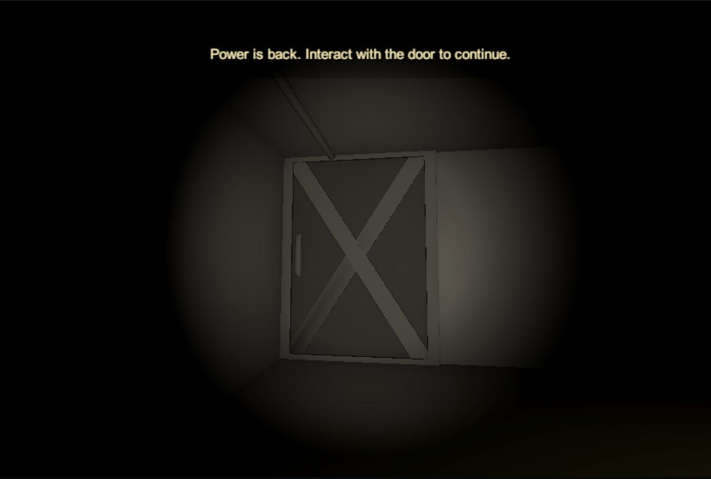
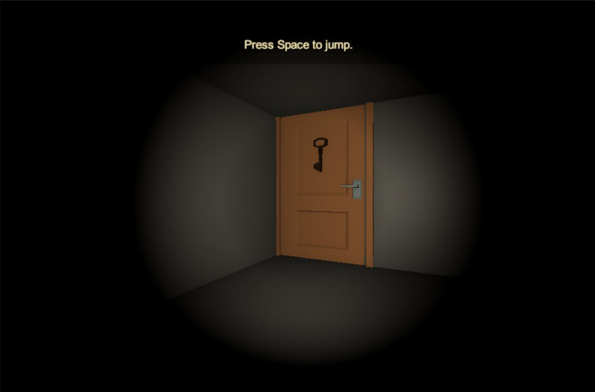
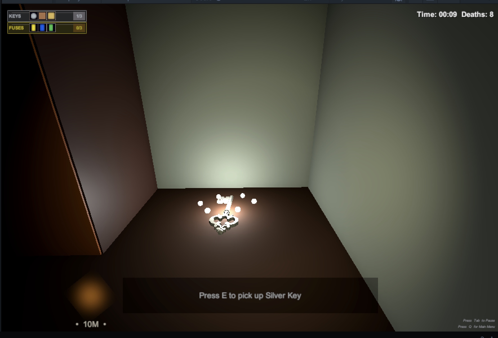
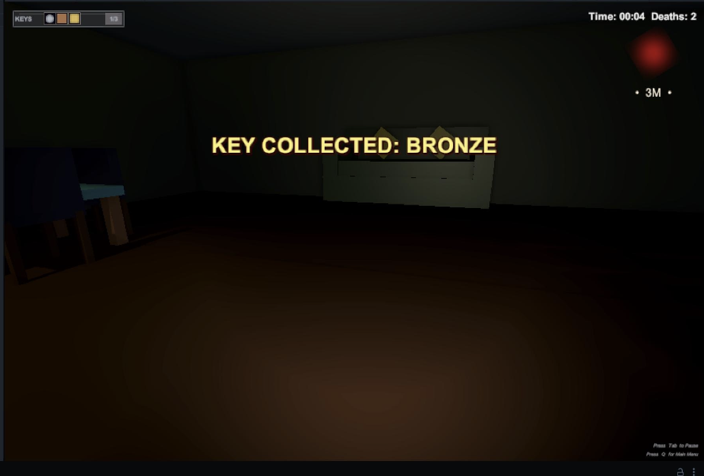
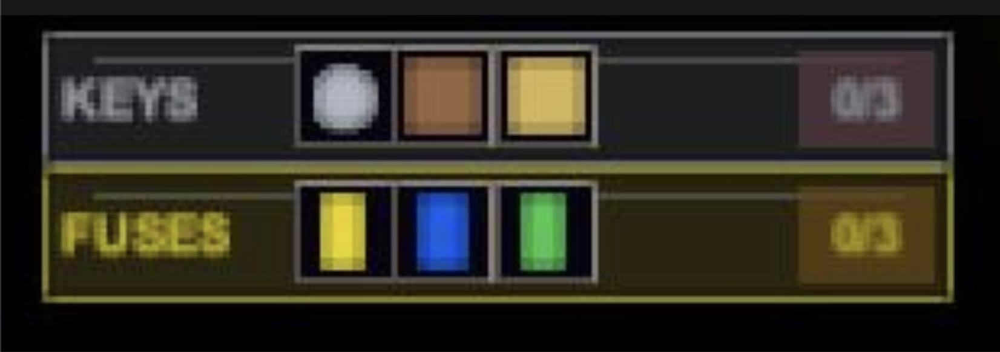
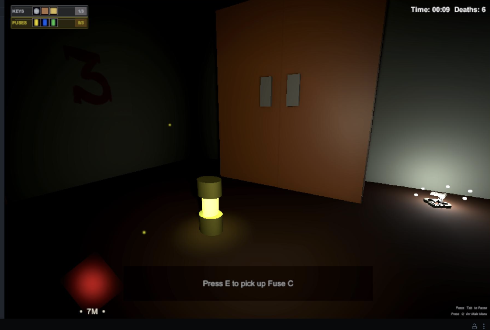

# Evil Resident

> *He hears every footstep. Don't blink.*

A first-person **stealth survival horror** game built in Unity. Navigate a dark,
confined house patrolled by a reactive stalker AI and a gaze-dependent pursuer —
manage visibility, attention, and routing while you collect keys, solve puzzles, and
power the fuse systems needed to escape.

  

## Overview

You're trapped in a multi-room house wired with locked doors arranged in a cyclical
key structure. Each room hides a key that unlocks the next, forcing repeated trips
through spaces you've already cleared while the danger escalates. Find the three keys,
restore power, unlock the main door, and get out — without being caught.

Two distinct threats hunt you:

- **The Resident** — an unkillable stalker AI that patrols, investigates noise, searches
  suspicious areas, and gives chase on sight. Its perception combines field-of-view cone
  vision with line-of-sight raycasts, close-proximity awareness, and noise-based hearing.
  If it reaches you during a chase, the run ends.
- **The Weeping Angel** — a gaze-dependent pursuer. It freezes while your camera is on it
  and advances the moment you look away. Contact is fatal. Keep your eyes on it.

## Objectives

- Collect three keys — **Bronze, Silver, and Gold** — spread across locked rooms.
- Find three fuses (**A, B, C**) and insert them into matching fuse boxes to restore power
  and open new areas. You can carry only one fuse at a time.
- Solve **color-wheel puzzles** to unlock keys and new pathways.
- Hide in cupboards to break line of sight and force enemies back into a search state.
- Unlock the main door with all keys and **escape the house**.

## Controls

| Input | Action |
|-------|--------|
| `W` `A` `S` `D` | Move |
| `Mouse` | Look around |
| `Space` | Jump |
| `E` | Interact (doors, keys, fuse boxes, fuse pickups, puzzle wheels) |
| `F` | Hide / exit hiding spot |
| `Tab` | Pause / resume |
| `Q` | Main menu |
| `R` | Restart scene (on Pause / Game Over / Escape) / reset puzzle |
| `Enter` or `Space` | Dismiss start screen |

## Features

- Complete playable loop across three difficulty tiers (**Easy / Medium / Hard**) with
  scene-specific AI tuning for speed, detection sensitivity, and patrol behavior.
- A four-part **tutorial** teaching movement, interaction, hiding, and enemy awareness.
- Full game-state UI: start screen, pause, game over, and escape/win overlays.
- A collectible **HUD** tracking key and fuse progress, a proximity-based heartbeat
  vignette when the Resident is near, and an on-screen enemy direction + distance indicator.
- Horror-styled flickering and fuse-activated lighting for an atmospheric, readable space.
- A runtime analytics pipeline posting survival statistics to Google Sheets.

## Screenshots

| | |
|---|---|
|  |  |
| **Main menu** — the start screen | **The Resident** — the primary stalker AI |
|  |  |
| **The Weeping Angel** — advances only when unobserved | **Fuse-gated door** — needs power to open |
|  |  |
| **Keyed door** — opened with the matching key | **Silver key pickup** (Medium) |
|  |  |
| **Key-collected feedback** during gameplay | **Collectible HUD** — keys (top) and fuses (bottom) |
|  | |
| **Fuse pickup** — *"Press E to pick up Fuse C"* | |

## Play it

- **Playable build:** https://sushildalavi.github.io/Evil_Resident/
- **Gameplay video:** https://youtube.com/watch?v=sGfhvhnqstE

## Running from source

This is a Unity project. Unity's `Library/` folder is intentionally excluded (it's
regenerated on open).

1. Open **Unity Hub** → **Add** → select this project folder.
2. Open with the matching Unity Editor version when prompted.
3. Load a scene from `Assets/` and press **Play**.

## Built with

Unity • C# • first-person controller, NavMesh-based AI, a global noise event system,
and a Google Sheets analytics integration.
